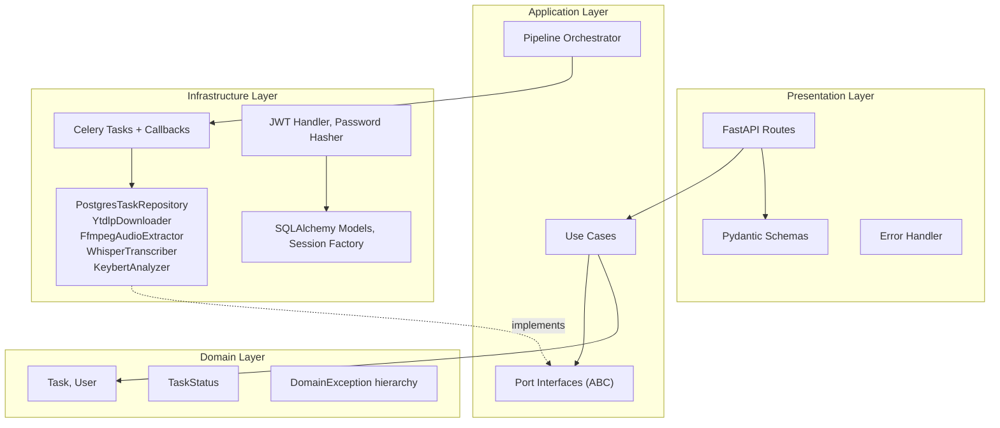
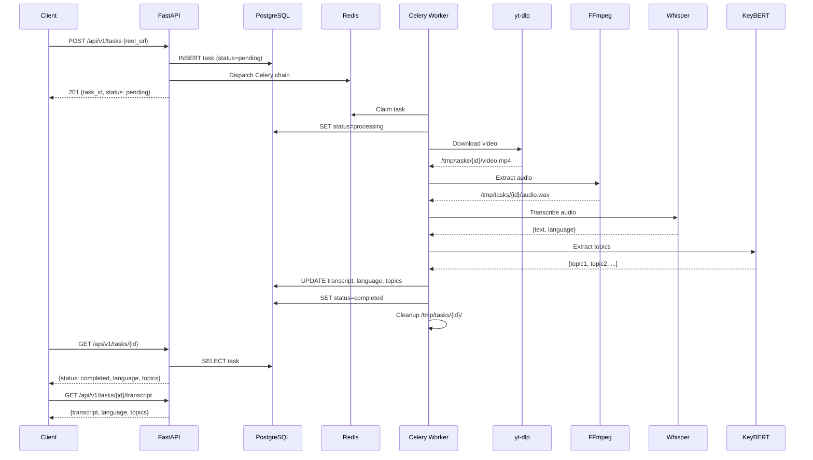
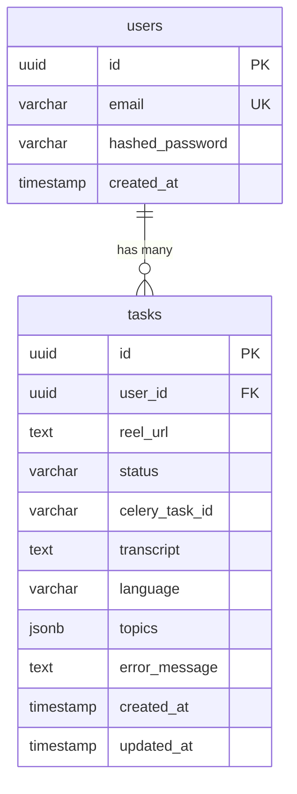

# Architecture

## Clean Architecture Overview

The backend follows Clean Architecture with four concentric layers. Dependencies point inward — outer layers depend on inner layers, never the reverse.



### Layer Rules

| Layer | May Import | Must Not Import |
|---|---|---|
| **Domain** | Python stdlib only | Application, Infrastructure, Presentation |
| **Application** | Domain | Infrastructure, Presentation |
| **Infrastructure** | Domain, Application | Presentation |
| **Presentation** | Domain, Application, Infrastructure* | — |

*Presentation imports infrastructure for DI wiring (`get_task_repository` dependency). The concrete adapter is resolved behind the abstract `TaskRepository` port interface.

## Dependency Injection

The DI container (`container.py`) is the single place where concrete adapters are wired to port interfaces:

```python
register_ports(
    task_repository=PostgresTaskRepository(session_factory),
    video_downloader=YtdlpDownloader(),
    audio_extractor=FfmpegAudioExtractor(),
    transcriber=WhisperTranscriber(),
    text_analyzer=KeybertAnalyzer(),
)
```

- **FastAPI routes** receive `TaskRepository` via `Depends(get_task_repository)`
- **Celery workers** resolve ports via a module-level registry, initialized on `worker_init` signal

## Processing Pipeline



### Cancellation Flow

1. Client sends `POST /api/v1/tasks/{id}/cancel`
2. API sets task status to `CANCELLED` in PostgreSQL
3. Each pipeline step checks status before executing via an atomic `UPDATE...WHERE status NOT IN (terminal_states)`
4. If the task is cancelled, the step returns early and the chain aborts
5. In-progress steps complete before the check — cancellation is cooperative, not preemptive

## Database Schema



**Indexes:** `idx_tasks_user_id`, `idx_tasks_status`

## Auth Flow

1. **Register:** `POST /auth/register` → hash password with bcrypt → store user → return JWT
2. **Login:** `POST /auth/login` → verify password → return JWT
3. **Protected routes:** `Authorization: Bearer <token>` → `HTTPBearer` extracts token → `verify_token` decodes JWT → extract `user_id` from `sub` claim
4. **Token expiration:** Configurable via `JWT_EXPIRATION_MINUTES` (default: 60 min)

## Error Handling

Errors propagate from adapters through domain exceptions to HTTP responses:

```
Adapter raises exception
  → Celery task catches it
    → callbacks.handle_failure() sets task status to FAILED
    → Error message stored in task.error_message

Domain exception raised in use case
  → FastAPI exception handler catches DomainException
    → Returns JSON: {detail, error_code} with appropriate HTTP status

Unhandled exception
  → Generic exception handler catches Exception
    → Returns 500: {detail: "Internal server error"}
    → Full traceback logged server-side
```

| Exception | HTTP Status | Error Code |
|---|---|---|
| `TaskNotFound` | 404 | `TASK_NOT_FOUND` |
| `InvalidURL` | 422 | `INVALID_URL` |
| `Unauthorized` | 401 | `UNAUTHORIZED` |
| `TaskAlreadyTerminal` | 409 | `TASK_ALREADY_TERMINAL` |
| `PipelineError` | 500 | `PIPELINE_ERROR` |

## Concurrency

- **Celery workers** process tasks with `concurrency=2` (prefork pool)
- **Each task** is a chain of 5 sequential steps — parallelism is across tasks, not within a task
- **Async I/O** in adapters uses `asyncio.to_thread()` for blocking operations (FFmpeg, Whisper)
- **Celery tasks** bridge async ports via `asyncio.run()`, creating a fresh event loop per step
- **Database connections** use SQLAlchemy's async session factory with connection pooling

## Testing Strategy

- **Unit tests** — Domain entities, use cases, and adapters tested in isolation with mocked ports
- **Integration tests** — Repository tests against SQLite with JSONB→JSON type remapping
- **Pytest-asyncio** for async test functions with `asyncio_mode = "auto"`
